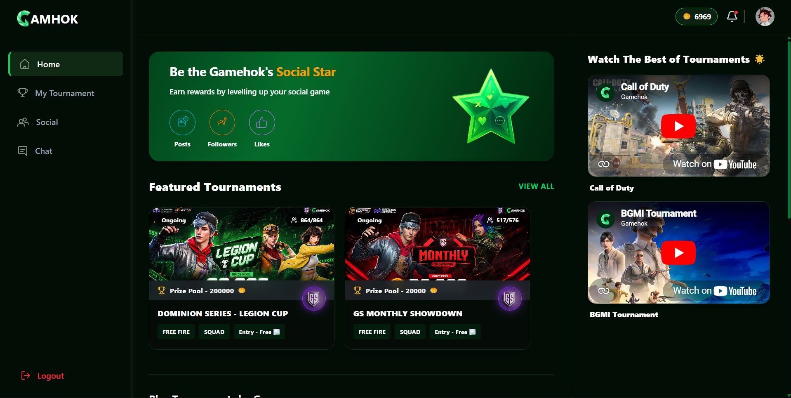

## GameHok Assignment 🌟

<p align="center">
    
</p>

<p align="center">
	<strong>A polished esports-style Next.js experience built for the GameHok assignment.</strong>
</p>

<p align="center">
	<a href="https://gamehok-assignment-stardust.vercel.app/">Live Demo</a>
	·
	<a href="#tech-stack">Tech Stack</a>
	·
	<a href="#folder-structure">Folder Structure</a>
</p>

## Overview ✨

GameHok Assignment is a modern tournament and gaming hub UI built with the App Router. The experience focuses on a bold visual layout, responsive sections, loading states, and smooth motion so the site feels more like a product showcase than a basic assignment.

The live site is available here:

https://gamehok-assignment-stardust.vercel.app/

## Features 🎮

- Hero-style home screen with featured tournament content
- Responsive layout with mobile-first behavior
- Dedicated routes for tournaments, social, chat, and tournament detail pages
- Loading skeletons for a smoother first impression
- Motion-driven UI elements for a more premium feel
- Clean component-based structure for reusable sections

## Tech Stack 🛠️

- Next.js 16 App Router
- React 19
- TypeScript
- Tailwind CSS 4
- Framer Motion
- Lucide React
<p align="center">
	
	&nbsp;
	<a href="https://gamehok-assignment-stardust.vercel.app/"></a>
</p>

<h1 align="center">GameHok Assignment — Playful Tournament UI</h1>

<p align="center">🚀 A polished, production-feeling Next.js demo showcasing tournaments, social feeds, and live-style UI interactions.</p>

---

## Preview 👀

<p align="center">
 	
</p>

Live demo: https://gamehok-assignment-stardust.vercel.app/

## Why this project? ✨

- Built to showcase a modern, responsive UI for esports-style tournaments and social features.
- Focus on delightful micro-interactions, motion, and polished loading states.
- Fast to iterate on: component-first structure with clear separation of concerns.

---

If you'd like a different color theme (red/blue/dark) or a personal hero screenshot, tell me your preference and I'll swap it in.

## Production-ready Highlights ✅

- App Router structure for scalable routing
- Component-driven pages and skeleton loading states
- Tailwind CSS for rapid, consistent styling
- Framer Motion for smooth, attention-grabbing transitions
- Clean project layout ready for feature expansion

## Tech Stack 🛠️

- Next.js 16 (App Router)
- React 19 + TypeScript
- Tailwind CSS 4
- Framer Motion
- Lucide React (icons)

## Quick Start (Local) 🧭

Clone, install, and run locally:

```bash
git clone https://github.com/StarDust130/gamehok_assignment.git
cd gamehok_assignment
npm install
npm run dev
```

Open http://localhost:3000 to explore.

## Build & Production

```bash
npm run build
npm run start
```

## Folder Snapshot 📂

Key areas to explore:

- `app/` — Pages, routing, and layouts
- `components/` — Reusable UI blocks (home, layout, skeletons)
- `lib/` — Lightweight helpers and data stubs
- `public/` — Static assets and images

## Contributing / Customizing 🔧

- Want this as a portfolio piece? I can add your name, role, and contact CTA.
- Need a dark/light theme toggle or CMS integration? I can wire that up.

## Contact ✉️

If you'd like a custom version of this README with your name, links, or a nicer screenshot, tell me what to include and I'll update it.

---

Made with ❤️ for the GameHok assignment.
